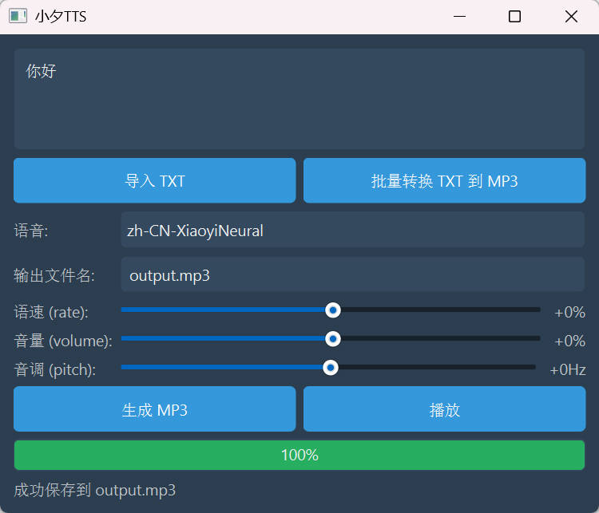

# edge-tts-gui

一个使用 PyQt6 为 edge-tts 制作的图形化界面。

## ✨ 功能

- **文本转语音**: 将输入的文本转换为 MP3 音频文件。
- **多种声音选择**: 支持多种中文语音模型。
- **音频参数调整**:
  - **语速**: 调整语音的快慢。
  - **音量**: 调整语音的音量大小。
  - **音调**: 调整语音的音高。
- **文件导入**: 支持从 TXT 文件导入文本内容。
- **批量转换**: 支持批量将多个 TXT 文件转换为 MP3 音频。
- **内置播放器**:可以直接在软件内播放生成的音频。
- **友好的用户界面**: 简洁美观的界面设计，易于上手。

## 🚀 如何使用

1.  在文本框中输入或粘贴需要转换的文字。
2.  或者点击 **导入 TXT** 按钮从本地加载文本文件。
3.  在 **语音** 下拉菜单中选择喜欢的声音。
4.  通过拖动滑块来调整 **语速**、**音量** 和 **音调**。
5.  在 **输出文件名** 处设置生成后音频文件的名字。
6.  点击 **生成 MP3** 按钮开始转换。
7.  转换成功后，可以点击 **播放** 按钮试听。
8.  如果需要一次性转换多个文件，点击 **批量转换 TXT 到 MP3** 按钮，选择多个 TXT 文件即可。
